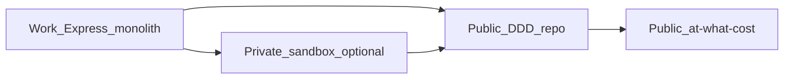
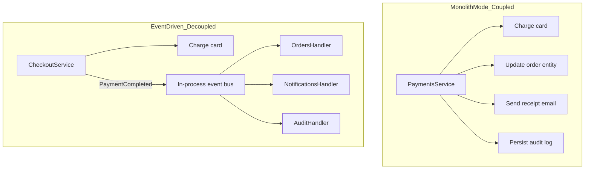

# at-what-cost — Architecture & Design Rationale

**Repo:** at-what-cost
**Stack:** NestJS 11 + TypeScript + Prisma + Redis + BullMQ + Docker Compose

**One-line pitch:** _Hands-on NestJS labs showing when and why to add cache, pub/sub, and background workers — with Docker, benchmarks, and no proprietary baggage._

Individual decisions with fuller context and trade-offs live in [docs/decisions/](decisions/). This file covers the overall shape of the repo. The writing standard both this file and the ADRs follow: [documentation-philosophy.md](documentation-philosophy.md).

---

## One repo or many?

One monorepo makes sense here given the goals — portfolio visibility, modular labs, shared Docker infra, and learning NestJS. That's a fit for this repo's current scope, not a claim that monorepos are generally superior.

|                  | **Monorepo (recommended)**                                       | **Separate repos per lab**                              |
| ---------------- | ---------------------------------------------------------------- | ------------------------------------------------------- |
| GitHub profile   | One strong pinned project with clear narrative                   | 3 small repos that can look sparse or fragmented        |
| Discovery        | Reviewer lands on README, picks a lab                            | Must hunt across repos                                  |
| Shared infra     | Single `docker-compose.yml`, one `shared/` package               | Duplicate Redis/Postgres setup 3×                       |
| CI / maintenance | One pipeline, workspace scripts                                  | 3× lint, typecheck, Actions config                      |
| Modularity       | Achieved via `labs/01-*` folders + independent `pnpm run lab:01` | True isolation, but modular _labs_, not modular _repos_ |
| Learning NestJS  | Consistent patterns across labs (modules, DI, decorators)        | Same, but more boilerplate duplication                  |

**When separate repos would make sense later:** if a single lab grows into a full standalone tutorial people fork independently.

See [ADR 0001](decisions/0001-monorepo-over-separate-repos.md) for the full reasoning.

---

## Learning path: work code → intermediate step → this repo



### 1. Private sandbox (optional)

Practice refactoring familiar problems without public exposure. Can stay Express + JS initially.

### 2. Public DDD repo (separate)

e.g. `ddd-node-playground` — bounded contexts, aggregates, domain events **in-process** (no Redis yet).

|          | DDD repo                        | at-what-cost                                  |
| -------- | ------------------------------- | --------------------------------------------- |
| Question | _What_ belongs together?        | _How_ do you wire decoupled parts at runtime? |
| Focus    | Bounded contexts, domain events | Cache, pub/sub, workers, benchmarks           |

### 3. This repo (at-what-cost)

Assumes you understand _why_ payment shouldn't send mail. Lab 02's monolith → events toggle shows the **operational payoff**.

**Suggested order:** Private sandbox (optional) → DDD repo → this repo.

---

## Why NestJS (vs plain Express at work)

- **Modules + DI** — testable, explicit boundaries
- **First-class integrations** — `@nestjs/cache-manager`, `@nestjs/microservices`, `@nestjs/bullmq`
- **TypeScript by default** — DTOs, validation, typed event payloads
- **Modules + events in one app** — Lab 02 decouples via in-process domain events (`@nestjs/event-emitter`), not separate services

Each lab README includes a **"NestJS vs plain Express"** callout.

See [ADR 0002](decisions/0002-nestjs-over-express.md) for the full reasoning.

---

## What you're demonstrating — and at what cost

| Pattern     | Primary benefit              | Scaling dimension                   | Cost introduced                                                                           |
| ----------- | ---------------------------- | ----------------------------------- | ------------------------------------------------------------------------------------------ |
| **Caching** | Fewer DB hits, lower latency | Read scalability, cost reduction    | Data can be stale between writes and cache expiry; invalidation bugs are silent            |
| **Pub/Sub** | Loose coupling, fan-out      | Horizontal scaling of consumers     | No single place to read the full flow; failures surface downstream, not at the source      |
| **Workers** | Offload slow work from HTTP  | Throughput, resilience under spikes | Caller no longer knows the outcome immediately; retries and failures need their own handling |

These patterns also improve **reliability** and **operational decoupling**, not just raw QPS — but none of them are free. Each lab's README states the specific cost for that lab's context, not just this general shape of it.

---

## God-service problem — in this repo

**Keep it in Lab 02.** Payment + entity updates + mail + audit in one class is the **motivation** for pub/sub.

Lab 02 uses **`ARCHITECTURE=monolith|events`** toggle (same API, two implementations).



Neither side is unconditionally better: the monolith is simpler to read, deploy, and debug end-to-end; the event-driven version isolates failures and scales consumers independently at the cost of losing that single-flow visibility. Lab 02's `ARCHITECTURE` toggle exists so both trade-offs are visible in the same codebase. This mirrors a real problem, rebuilt with a synthetic domain so it's safe to publish — see [ADR 0003](decisions/0003-synthetic-data-no-proprietary-code.md).

The events side stays **in-process** (one Nest app), not separate services — decoupling is a code-boundary decision here, distribution is a later, load-driven one. See [ADR 0004](decisions/0004-events-are-not-microservices.md).

---

## Repository structure

```
at-what-cost/
├── README.md
├── docker-compose.yml           # Postgres + Redis
├── package.json
├── pnpm-workspace.yaml          # pnpm workspaces
├── labs/
│   ├── 01-caching/
│   ├── 02-pub-sub/              # single Nest app; checkout + in-process handlers
│   └── 03-background-workers/
├── shared/
│   ├── types/
│   └── lib/
└── docs/
    ├── documentation-philosophy.md  # writing standard for every doc here
    ├── PLAN.md                  # this file
    └── decisions/                # ADRs — why, not just what
```

---

## Lab designs

### Lab 01 — Caching (Redis cache-aside)

- `CACHE_ENABLED=false|true` toggle
- Postgres ~10k products, cache-aside in `ProductsService`
- `PATCH /products/:id` invalidates cache
- `scripts/benchmark.ts` — autocannon before/after

### Lab 02 — Pub/Sub (checkout god-service → events)

Single Nest app, one `ARCHITECTURE=monolith|events` toggle (same API, two implementations) — not separate services. Splitting processes is a load-profile decision (Lab 04), not required to show decoupling.

**Act 1 — Monolith:** `POST /checkout` — charge → update order → email → audit inline (sequential, coupled failures)

**Act 2 — Events:** `CheckoutService` emits `PaymentCompleted` in-process (`@nestjs/event-emitter`); `orders`, `notifications`, `audit` handlers react independently

- `scripts/demo-flow.ts` — failure isolation comparison
- Env: `SIMULATE_EMAIL_FAILURE=true` shows monolith vs events difference

### Lab 03 — Background workers (BullMQ)

- `POST /reports` → 202 + jobId; worker processes async
- `SYNC_MODE=true` for before/after comparison
- `scripts/spike-test.ts` — 100 enqueued jobs

---

## Benchmark scripts

| Lab | Script          | Compares                                   |
| --- | --------------- | ------------------------------------------ |
| 01  | `benchmark.ts`  | p50/p99, req/sec cache off vs on           |
| 02  | `demo-flow.ts`  | Failure isolation: monolith 5xx (audit skipped) vs events 2xx (audit written) |
| 03  | `spike-test.ts` | Async vs sync API p99                      |

---

## Tech choices

| Concern    | Choice                                    |
| ---------- | ----------------------------------------- |
| Framework  | NestJS 11                                 |
| ORM        | Prisma                                    |
| Caching    | `@nestjs/cache-manager` + Redis           |
| Pub/Sub    | `@nestjs/event-emitter` (in-process)      |
| Jobs       | `@nestjs/bullmq`                          |
| Monorepo   | pnpm workspaces                           |
| Benchmarks | autocannon + custom scripts               |
| Node       | 22 LTS (pnpm 11's package index requires Node ≥22.13) |

---

## Out of scope for v1 (roadmap)

- **Lab 04:** Rate limiting + horizontal API scaling
- **Lab 05:** Idempotency keys for webhook consumers
- **Lab 06:** CQRS read model (event projection)
- **`docs/when-to-use-what.md`:** a cross-lab decision guide (cache vs. pub/sub vs. workers, side by side). Deferred until at least Lab 02 exists — with one lab built, there's nothing yet to compare it against.
- **`docs/enterprise-analogies.md`:** mapping each lab's synthetic domain back to the real systems it stands in for. Same reasoning — deferred until there's more than one lab's worth of analogies to draw.

---

## Success criteria

1. Clone → run Lab 01 in under 5 minutes
2. Each lab README explains **why**, not just **how**
3. Numeric before/after proof in every lab
4. Safe to share publicly — no employer details
5. Lab 02 shows god-service decomposition without real payment systems
6. Each lab README names the pattern's cost explicitly — staleness, failure modes, operational burden — not only its benefit. This is the repo's namesake question, so it can't be left implicit.
7. No lab or doc claims a pattern is universally correct; each states the conditions under which it wouldn't be worth adopting
